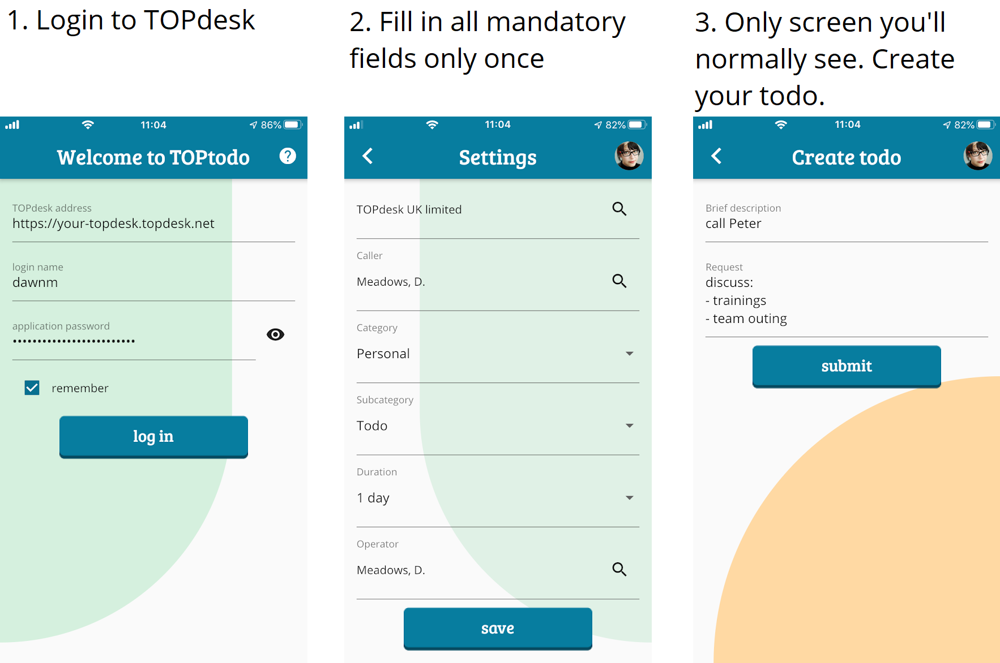
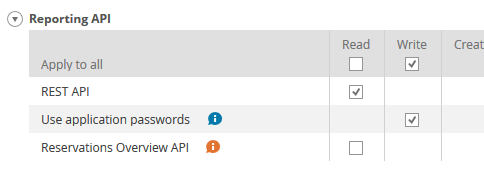
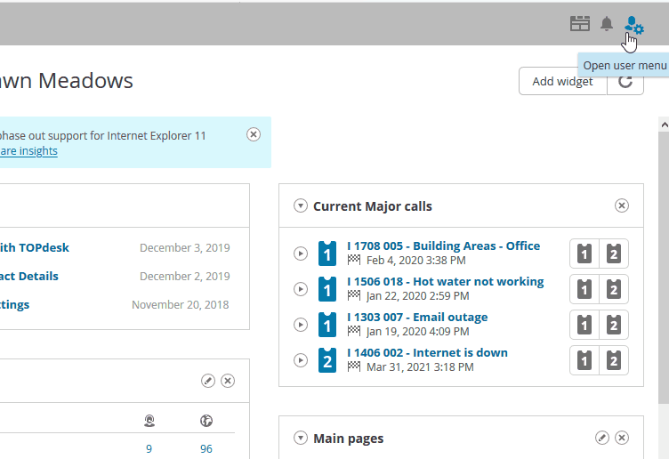

# TOPtodo

A mobile app that connects to [TOPdesk](https://topdesk.com). Quickly create an incident as a todo item. Fill in all required fields only once. A new todo item only requires a new brief description and optionally a longer request.

## Status

This app is currently under development and not yet available.

## How it works

## TOPdesk authorization

You need to have the right authorization levels within TOPdesk to be able to use this app. Of course you need to be able to create incidents, but you also need to be allowed to use the *REST API*. You might need to contact your TOPdesk application manager to enable these.

## Application password

The mobile app needs an *application password*. This is different from the normal password that is used to log into the TOPdesk web interface. You need to create a password yourself. See below how.

