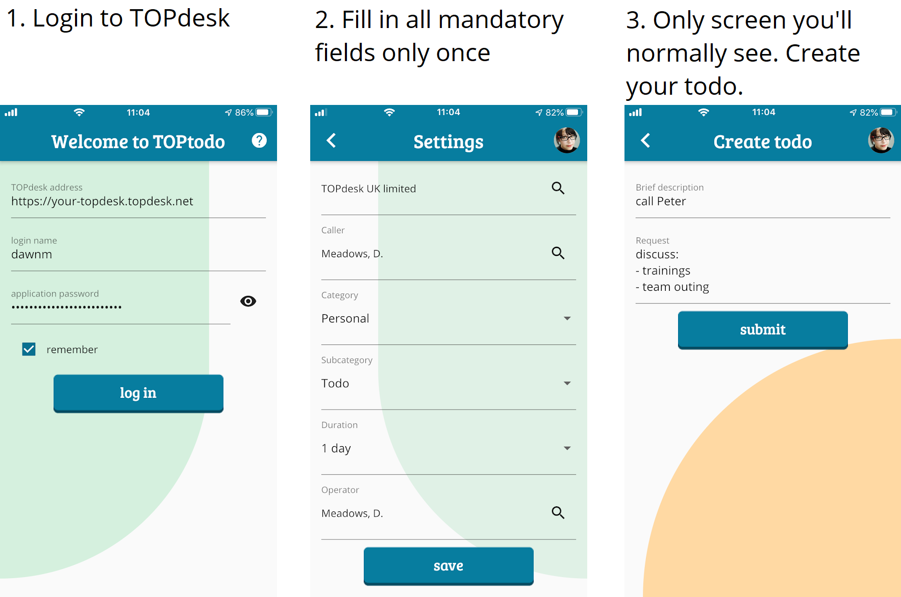
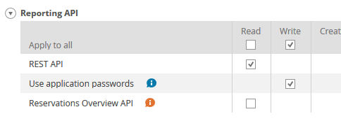

# TOPtodo

A mobile app that connects to [TOPdesk](https://topdesk.com). Quickly create an incident as a todo item. Fill in all required fields only once. A new todo item only requires a new brief description and optionally a longer request.

With TOPtodo you can only create incidents. Use TOPdesk to see and modify the incidents.

## Status

This app is currently under development. A beta release is available on the [Google Play Store](https://play.google.com/store/apps/details?id=com.github.bennorichters.toptodo) and [Apple's App Store](https://apps.apple.com/app/id1496496893).

## How it works

## TOPdesk authorization

You need to have the right authorization levels within TOPdesk to be able to use this app. Of course you need to be able to create incidents, but you also need to be allowed to use the _REST API_ and to create _application passwords_. You might need to contact your TOPdesk application manager to enable these.

## Application password

The mobile app needs an _application password_. This is different from the normal password that is used to log into the TOPdesk web interface. You need to create a password yourself. See below how.

## About

TOPtodo is an [open source project](https://github.com/bennorichters/TOPtodo/). This application is not developed nor maintained by the company TOPdesk.
